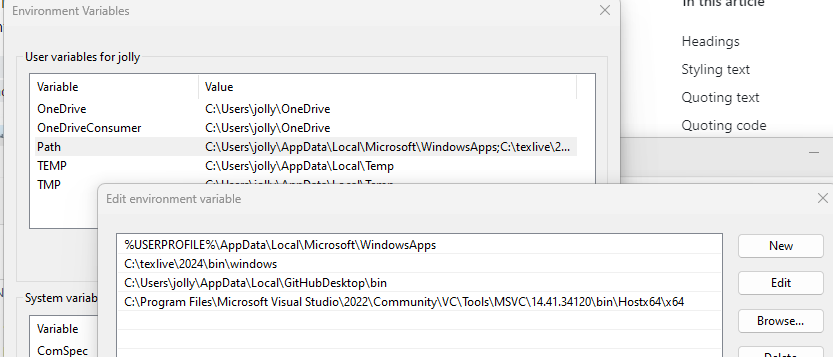
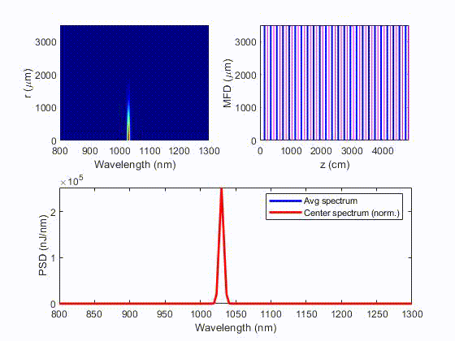
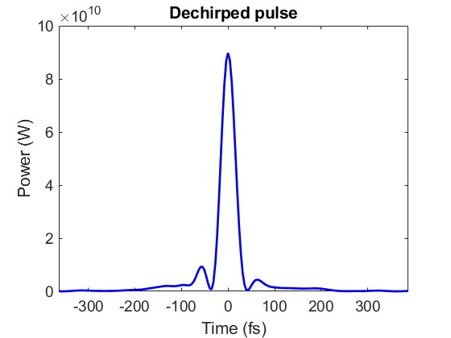
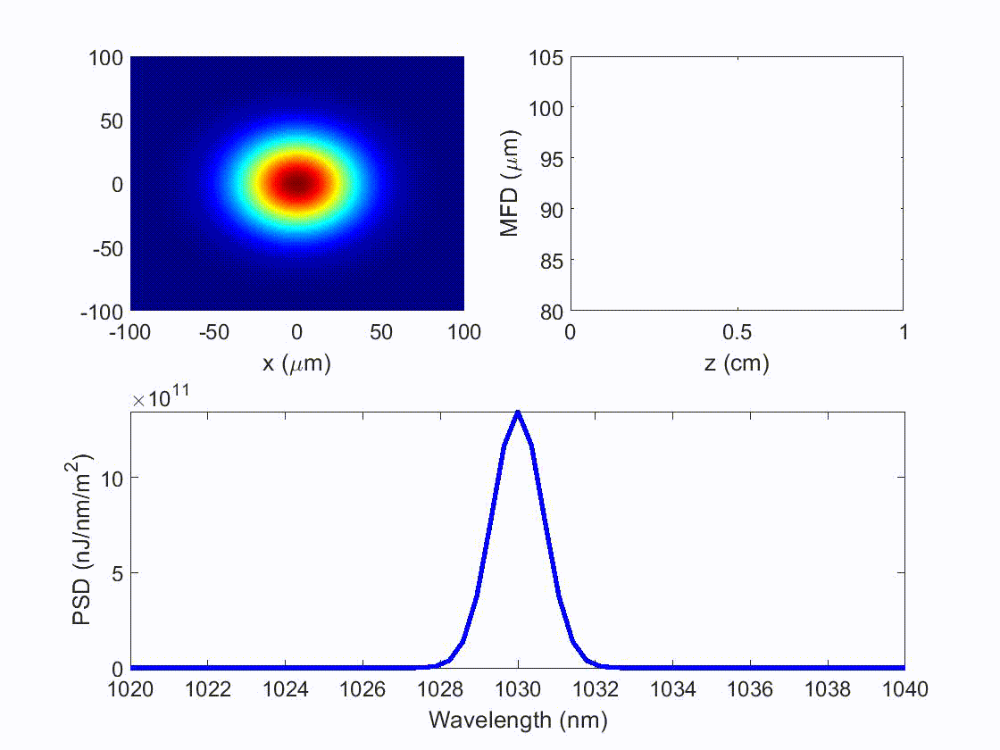

# 3D-UPPE
This is the shared package to simulate, with MATLAB, pulse propagation in bulk crystal/gas/free space with 3D-UPPE.

It is useful for simulating simulating solid-based or gas-filled multipass cell or multiplate compressor, etc.

## Capabilities:
1. It solves the pulse propagation with a nested [RK4IP](http://www.sciencedirect.com/science/article/pii/S0010465512004262) (Runge-Kutta under the interaction picture). Please find details in the 3D-UPPE's readme.
2. Adaptive step-size control is implemented (for the nested RK4IP).
3. Support broadband scenarios by having $\beta_p(\omega)$.
4. Support both scalar and polarized scenarios, controlled with `sim.scalar=true/false`.
7. Support noise-seeded processes, such as spontaneous Raman scattering, with [the newly-developed noise model](https://doi.org/10.48550/arXiv.2410.20567).
8. Efficient GPU computation (with Nvidia CUDA) is implemented. It is controlled by `sim.gpu_yes=true/false`.
9. Support radially-symmetric scheme with the Hankel transform for efficient modeling.
10. Support both solid and gas environments.
11. For gases, it supports both noble and Raman-active gases with the newly-developed vector Raman model [[1]](#references-our-papers).
12. Support photoionization in gases with the Perelomov-Popov-Terent'ev (PPT) model.

## Fourier-Transform tutorial
Since I've seen many misuse of Fourier Transform, I wrote [this tutorial](https://doi.org/10.48550/arXiv.2412.20698). Please take a look. Briefly speaking for one misuse, it's necessary to use MATLAB's `ifft` for Fourier Transform into the spectral domain.

## How to activate CUDA for GPU computing in MATLAB:
Typically MATLAB deals with this, but there are still come steps to follow before CUDA can really be used, especially when compiling .cu files to generate .ptx files. Below I show only steps for Windows. For linux, please search for their specific steps. I've never used Mac, so I cannot comment anything on this; some functions need to be revised for extended capabilities for Mac as far as I know. 
1. Install [CUDA Toolkit](https://developer.nvidia.com/cuda-toolkit)
2. Install [Visual Studio Community](https://visualstudio.microsoft.com/vs/community/). Only **Desktop development with C++** is required. If it later says that it needs to install some other components due to the dependency issues, also install them.

3. Add required path of Visual Studio to computer's environmental PATH; otherwise, MATLAB, during compiling .cu files, will say "cl.exe" cannot be found.

4. Restart the computer if something is wrong. Connections between MATLAB and CUDA or Visual Studio requires restarting to be effective.
> [!WARNING]
> MATLAB supports only a certain version of CUDA and GPUs ([support list](https://www.mathworks.com/help/releases/R2021b/parallel-computing/gpu-support-by-release.html)). CUDA or GPU that is too old just isn't supported.

## References (our papers):
1. [Raman scattering](https://doi.org/10.1063/5.0189749)
2. [Noise modeling](https://doi.org/10.48550/arXiv.2410.20567)

## Demonstrations:
- **Gas-filled Multipass cell**  
A multipass cell acts as a discrete waveguide that is commonly used for pulse compression.  
Below is an Ar-filled multipass cell that compresses a 210-fs pulse to 35 fs (dechirped pulse shown on the right).
Source: "UPPE3D/Examples/Multipass cell/Gas-filled MPC/Ar"  

- **Periodically-layered Kerr medium (non-waveguide)**  
[Periodically-layered medium](https://doi.org/10.1364/OL.539381) in air can be a waveguide in nonlinear conditions.  
It acts as a discrete "nonlinear" waveguide with interleaving media of low (e.g., air) and high (e.g., thin glass) nonlinear refractive indices. Thin glass induces nonlinear self-focusing and air introduces diffraction. This artificially-contructed waveguide nonlinearly broadens the pulse, introducing self-phase modulation that can be compensated with a dechirper. This results in a temporally-compressed pulse. Typical compression factor is around 5.  
Source: "UPPE3D/Examples/Periodically-layered Kerr medium (PLKM) compressor"  

- **Self focusing (non-waveguide)**  
Pulse with high peak power will experience self-focusing in a Kerr medium with a positive nonlinear refractive index. The medium effectively acts as a lens, reducing the propagating beam size.  
Source: "UPPE3D/Examples/Tutorial/2. pulsed/Self-focusing (non-waveguide)"  

## Notes:
There is a `readme.pdf` in the `Documentations/` folder of **UPPE3D**. Please find details of how to use this package in it. However, the fastest way to learn how to use this package is to learn from the examples in the `Examples/` folder.

I'm Yi-Hao Chen, the author of the code and from Frank Wise's group at Cornell Applied Physics.

## History:
...